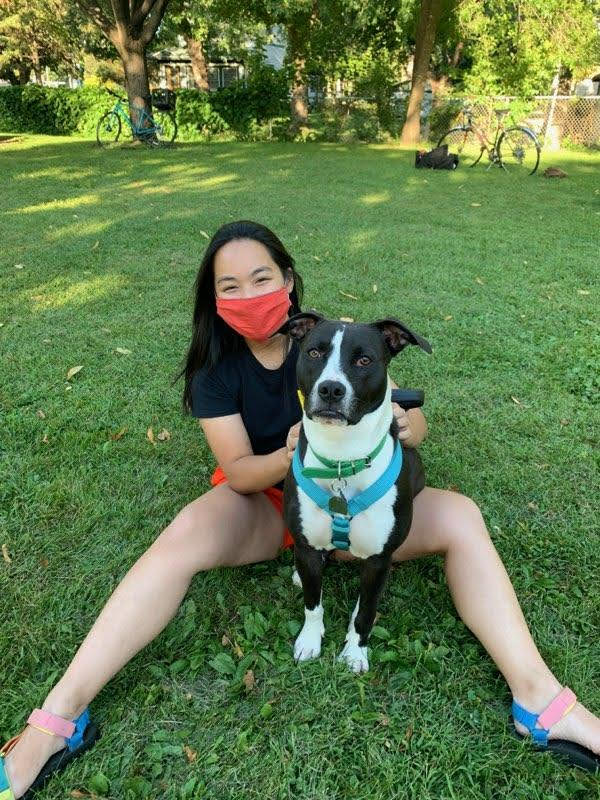

```{r setup, include=FALSE}
knitr::opts_chunk$set(echo = FALSE)

```




## About me: I am a biology major and data science minor at Macalester College. I am originally from Eugene, Oregon and love to spend time outdoors playing ultimate frisbee and going on hikes. My academic interests include data visualization, data analytics, and quantitative ecology. You can find me either in Oregon or Minnesota (or some other cool state inbetween). 

## Education:
Macalester College | St. Paul, MN 
BA in Biology and Data Science, Sept, 2018 - May, 2022

